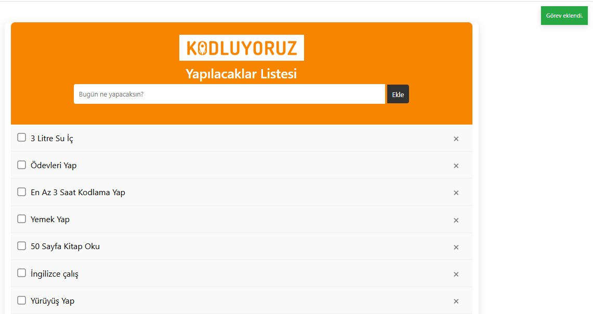
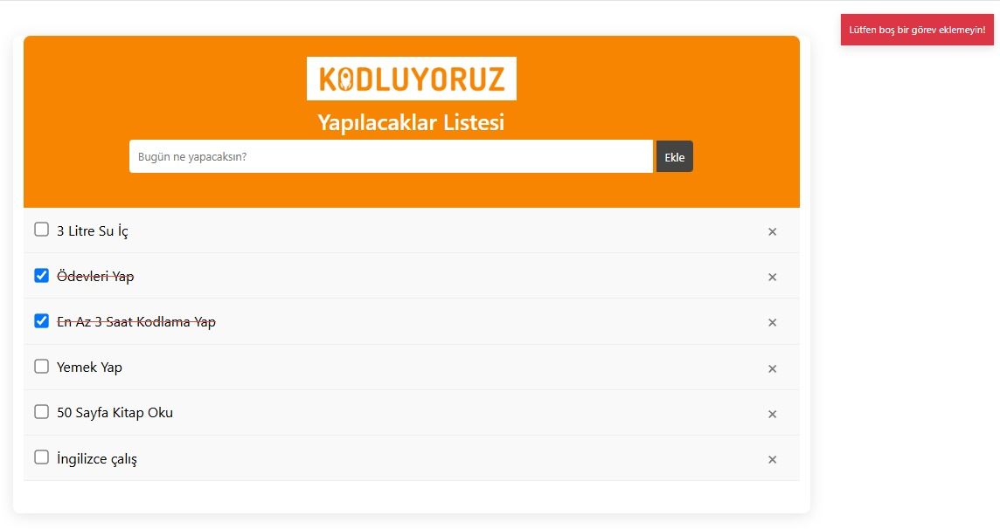

# 📝 Yapılacaklar Listesi (To-Do List)

Bu proje, HTML, CSS ve JavaScript kullanılarak geliştirilmiş basit bir yapılacaklar listesi uygulamasıdır.  
Kullanıcılar görev ekleyebilir, tamamladıklarını işaretleyebilir, silebilir ve **sayfa yenilense bile görevleri kaybolmaz** (localStorage kullanılır).

## 🚀 Özellikler

- ✅ Görev ekleme
- ✅ Görevleri checkbox ile tamamlama
- ✅ Tamamlanan görevlerin üzeri kırmızı çizilir
- ✅ Görev silme
- ✅ Boş görev girildiğinde uyarı gösterimi (Bootstrap toast)
- ✅ **localStorage ile veriler kalıcı olarak saklanır**

## 💻 Kullanılan Teknolojiler

- HTML5
- CSS3 (Flexbox, Responsive yapı)
- Vanilla JavaScript (DOM işlemleri, EventListener, localStorage)
- Bootstrap (sadece toast bildirim için)

## 🧩 Nasıl Çalışır?

1. `index.html` dosyasını bir tarayıcıda aç  
2. Yeni görev ekle, checkbox ile tamamla veya sil  
3. Sayfayı yenilesen bile görevlerin aynı şekilde kalır  
4. localStorage görevleri tarayıcıda saklar

## 📷 Görünüm

